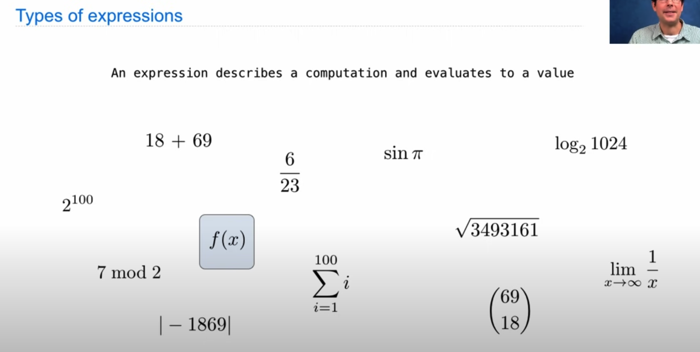
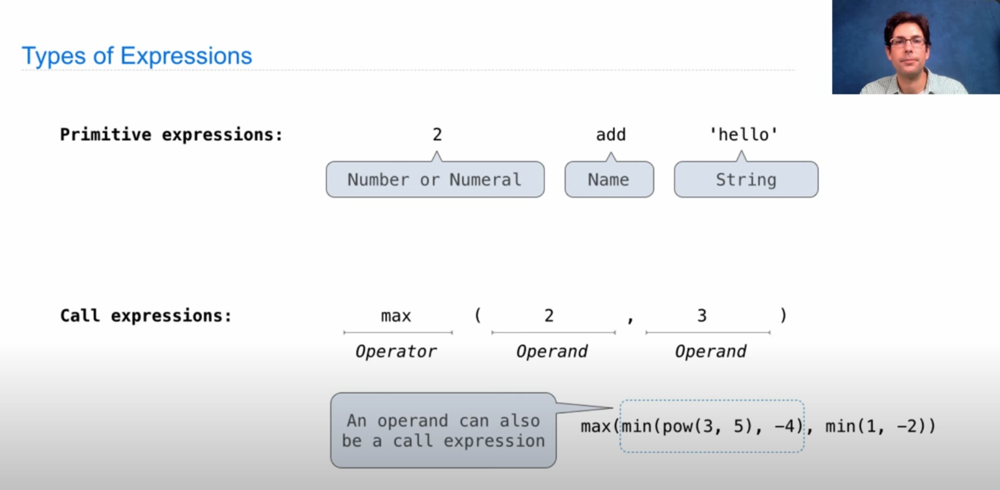
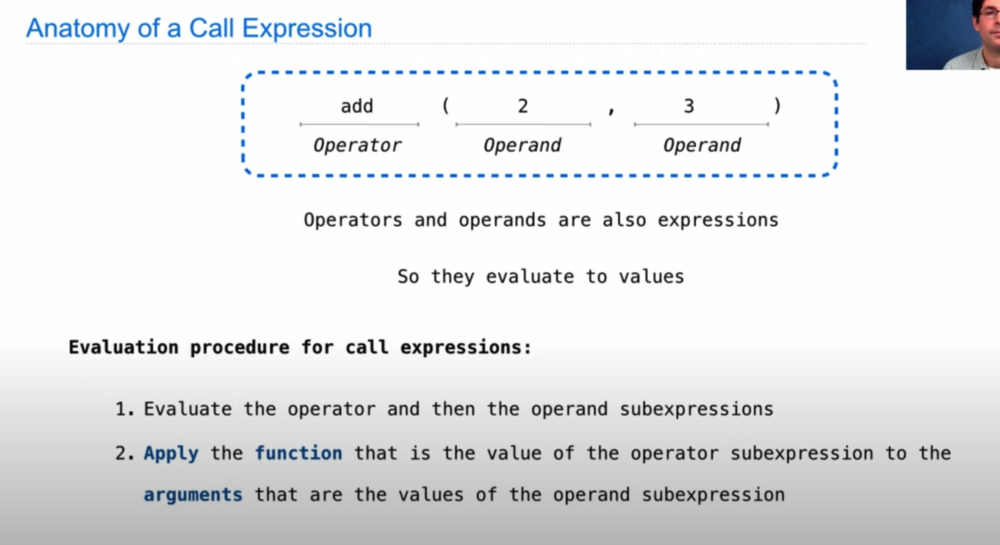
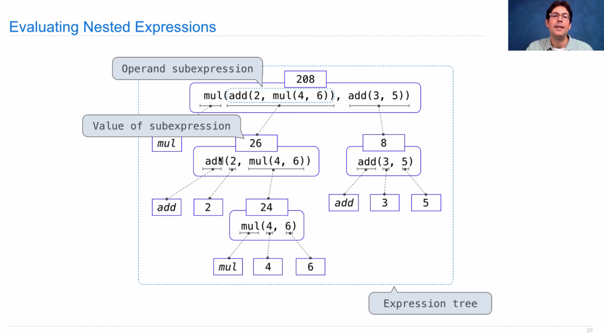

# JS是如何执行的


## 词法作用域 动态作用域

__作用域__

>scope is all about variable lookup bind value
>
>查找变量绑定的值

静态作用域: 作用域在函数声明时就确定的

动态作用域: 作用域在调用时决定的

作用域链: local scope -> parent scope ... -> global scope


## scope

function scope
block scope
module scope


__return value of inner function call__

```js
function outer(m){
  function inner(t){
		return m*t
  }
  return inner(Math.PI)
}
```

__return value of inner function reference__

```js
function outer(m){
  function inner(t){
    return m*t
  }
  return inner
}
```


```js
const area = (r,shape_constant) => r*r*shape_constant
const area_square = r => area(r,1)
const area_circle = r => area(r,Math.PI)
const area_hexagon = r => area(r, 3 * Math.sqrt(3) / 2)
```


dynamic scope vs lexical scope

scope is determined at run time: look up (name/identifier/variable)  bind  value at run-time


context object


__dynamic scope__

scope is determined at run time: look up (name/identifier/variable)  bind  value at run-time


???+ tip

​	作用域本质是变量查找机制,想深入理解推荐 [berkeley cs61a](https://cs61a.org)


- [x] expression type




- [x] call expression

  

- [x] call expression evaluation precedure



- [x] expression tree

  

## 执行上下文

```js
var foo = function(){
  console.log('foo1')
}
foo()

var foo = function(){
  console.log('foo2')
}

foo()
// foo1 foo2
```

```js
function foo() {
  console.log('foo1')
}
foo()

function foo(){
  console.log('foo2')
}

foo()
// foo2 foo2
```

## 执行上下文

executable code : 全局代码 函数代码 eval

execution context:

execution context stack


__executable code -> compile -> execution__

- compile: 函数的定义 声明 变量的声明 函数的形参

```js
function foo(a){
  var b = 2
  function c {}
  var d = function(){}
}
foo(1)

// complie phare
localAO = {
  arguments:{
    length:1
  },
  a: 1,
  b: undefined,
  c: reference to function c {},
  d: undefined
}
// execution pharse
localAO = {
	arguments: {
    length:1
  }
  a: 1,
  b: 2,
  c: reference to function c {},
  d: reference to function expression
}
```


```js
localAO = {

}
parentAO ={

}
globalAO = {

}
ECStack = [
  globalContext,
  parentContext,
  localContext
]
```


```js
var scope = "global scope"
function checkscope(){
  var scope = "local scope"
  return scope
}
```

> 调用函数checkScope时, 不会立即执行, 而是会进行准备工作 VO /scope chain/ this

```js
ECStack = [
  globalContext,
  checkscopeContext
]
checkscopeContext = {
	[[scope]]:[AO,globalAO],
	AO: {
    argument:{
      length: 0
    }
    scope: undefined
  }
}
```

> 调用执行阶段

```js
checkscopeContext = {
	[[scope]]:[AO,globalAO],
	AO: {
    argument:{
      length: 0
    }
    scope: 'local scope'
  }
}
```

### 闭包

闭包 = 不是在当前作用域(Activation Object),但仍可以访问的变量

> 理论上来说,所有函数都是闭包
>
> 实践上来说,即使创建它的上下文已经销毁,它仍然存在

比如说下面例子中的变量n

```js
function makeAdder(n){
  function adder(k){
    	return k + n
  }
  return adder
}

```

```js
-> const addThree = makeAdder(3)
// when enter func
EcsStack = [
  globalContext.VO,
  makeAdderContext.AO,
]
// after func call
EcsStack = [
  globalContext.VO,
]
-> addThree(4)
// when func call
EcsStack = [
  globalContext.VO,
  adderContext.AO,
]
// after func call
EcsStack = [
  globalContext.VO,
]
```

返回的内部函数`adder`维护了一个作用域链

```js
addThree(4)
adderContext = {
  Scope: [AO, makeAdderContext.AO, globalContext.VO]
}
```

因为这个作用域链,`adder`函数依然可以读取到`makeAdderContext.AO`中变量绑定的值,当在`adder`函数内部引用了`makeAdderContext.AO`中的值,即使`makeAdderContext`被销毁了,但是JS依然会让`makeAdderContext.AO`活在内存中, `adder`函数依然可以通过函数的作用域链找到它,正是因为JS做到这点,从而实现了闭包

!!! abstract "实践角度上的闭包"

	1. 即使创建它的上下文已经销毁,它仍然存在(内部函数从父函数返回)
	1. 在内部函数中引用了父函数中的变量

​
