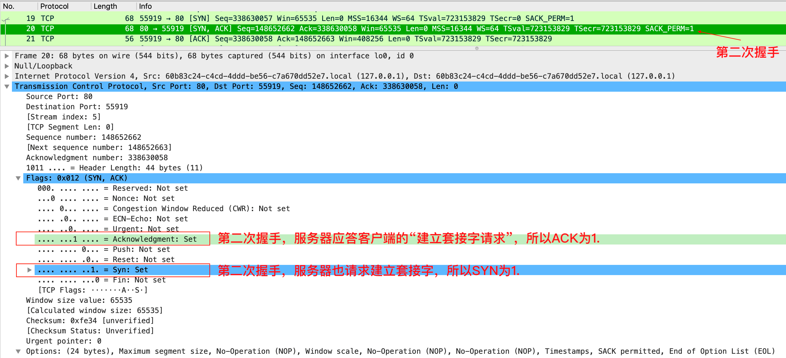

## 网络环境检测

```sh
networksetup -getwebproxy Wi-Fi
Enabled: Yes
Server: 127.0.0.1
Port: 6152
Authenticated Proxy Enabled: 0
```


## network connection troubleshooting steps


## 网卡

:::info 本机的四大块网卡


​启动本地开发服务器(Client和Server可以不在一台机器上)，配置监听主机`host`
- `localhost`: 限制只能从本机访问,
- `0.0.0.0`: 不限定只能从本机访问，还可以从局域网的其他设备通过局域网ip访问

loopback (回环网卡)

vEthernet（虚拟网卡）比如 `wls2`

en0 ethernet（有线网卡）

wlan（你的无线网卡） 

bind server to host `0.0.0.0`,
监听本机所有网卡的 IP 地址的请求
```sh
➜  Local:   http://localhost:5173/tech_insight/
➜  Network: http://192.168.0.102:5173/tech_insight/
➜  Network: http://172.24.112.1:5173/tech_insight/

# 没插网线,连了wifi,加上wsl.exe启动了虚拟网卡，刚好3个
$ ipconfig
以太网适配器 以太网:
   媒体状态  . . . . . . . . . . . . : 媒体已断开连接
无线局域网适配器 WLAN:
   IPv4 地址 . . . . . . . . . . . . : 192.168.0.102
以太网适配器 vEthernet (WSL):
   IPv4 地址 . . . . . . . . . . . . : 172.24.112.1
```


NAT会将我们的私有地址转成路由器中的公网IP与外部Internet连接

iptables

::: tip reference
　现在有两台pc在同一个局域网内，分别为pc1与pc2，pc1上有一个网卡，IP地址为192.168.10.128，那么：

（1）pc1中sever监听127.0.0.1，则pc1中的client可以连上127.0.0.1，192.168.10.128连不上；而pc2中client都连不上。

（2）pc1中sever监听192.168.10.128，则pc1中的client可以连上192.168.10.128，127.0.0.1连不上；而pc2中client能连上192.168.10.128。

（3）pc1中sever监听0.0.0.0，则pc1中的client可以连上127.0.0.1和192.168.10.128，pc2中的client能连上192.168.10.128。
:::

<!--  -->
:::


### gateway and NAT

###  域名劫持和污染

使用OpenDNS（208.67.222.222）或GoogleDNS（8.8.8.8）第三方的DNS服务器
自己用VPS搭建DNS服务器
修改机器host文件，直接IP访问
domain name may not be resolved locally at all.
域名可能根本无法在本地解析。

### ip封锁
使用HTTP代理。客户端不在直接请求目标服务器，而是请求代理服务器，代理服务器在去请求目标服务器。
对于HTTP代理来说，封锁起来非常简单。因为HTTP协议是明文，Request Message中就带有要请求的URL或IP地址，这样很容易就被检测到。对于HTTPS来说，虽然通信是进行加密了，但是在建连之前会给代理服务器发送CONNECT方法，这里也会带上要访问的远端服务器地址。如果代理服务器在国外，在出去前就会被检测到。 如果代理服务器在国内，呵呵，你也出不去啊。
```
CONNECT: www.google.com
```


http/https/socks5 代理、机场流量转发 (懂的)、软路由 (相当强悍)、MitM&readWrite (比金瓶梅 Charles 好用)、DNS 代理、模块和脚本

## socket
client sent
http session based

IM即时通讯
server sent
消息需要及时推送到client,连接中断清理服务器资源

### socket的三重身份

socket as library:
网络接口的实现集合
域名解析 `gethostbyname`
应用层调用 Socket 库接口，把数据给到传输层，后面数据才能够发出去

互联网上两个终端 (比如客户端和服务器) 如果需要通讯，就需要知道对方的 IP 和 Port
IP 通过 gethostbyname 已经拿到了，Port 应用层在请求的时候已经知道，比如 HTTP 默认 80，HTTPS 默认 443

data storage
`gethostbyname` 接口把解析出请求终端的ip和port存储到了套接字
`connect` 接口把三次握手状态记录到了套接字中。

socket中间件
TCP 在丢包控制、流量控制、拥塞控制方面是碾压 UDP 的。上面的三次握手就是在做稳定连接的工作，而其他四个方面就是通过滑动窗口和拥塞窗口实现的

### webscoket
WebSocket 和 HTTP 一样属于应用层协议，WebSocket 通过 HTTP 建立连接，然后不断开通道


### why heart,心跳机制要解决什么问题


终端网络波动太大：尤其移动端特别明显，进出电梯时候的网络屏蔽、网络供应商切换时候的 IP 更换、高速移动过程中基站的变更等等
NAT 超时后映射会销毁，中断通路：是运营商为了节省资源和降低网关压力，对一段时间没有数据收发的连接，会清理掉。这时候终端和服务端都是完好的，但是中间的通路却断了。
企业等防火墙：会在一段时间后关闭网络包传输。这个和 NAT 超时类似，防火墙会定时对一段时间没有数据收发对连接进行关闭，如 5 分钟。


## TCP数据传输过程


### 数据包长度

网络层一个网络包的最大长度，为 65535 字节: 2^16-1，约64KB, 用于标记一个包大小的位数是16位

链路层MTU 分片。

### 数据包丢包

UDP 会进行数据校验（UDP 的头部有 16 位大小的” 校验和” 字段），发现数据不完整，就会丢弃。

### drop the pakcaet

### 数据包超时重传 
timeout and retry


### 三次握手

:::info white-space collapse control

pre: text-wrapping:  no wrap    
pre-line: sequence of white space(tab) collapse, new lines wrap. text-wrap    
pre-wrap: sequence of white space(tab) preserve, new lines wrap. text-wrap 
:::


<pre sytle="white-space: pre-wrap; background-color: red">
SYN 是用来请求建立连接（建立套接字）的  
第一次和第二次握手，在 C 和 S 端均发送了 SYN，表示双方均希望建立连接。
而 ACK 是 SYN 的答复，同意建立套接字
第二次和第，在 S 和 C 端均发送了 ACK，表示双方均回执了对方的建立连接请求。
</pre>





### 四次挥手


### 滑动窗口


## wsl2 http请求配置

```sh
$ ipconfig
vEthernet
IPv4 address  : 192.168.208.1
# 配置代理：请求由虚拟网卡接管
$ env | grep proxy
https_proxy=192.168.208.1:7897
all_proxy=192.168.208.1:7897
http_proxy=192.168.208.1:7897
# 代理上启用Allow LAN，监听虚拟网卡的流量
```


### 正向代理和反向代理

clien-side aware

server-side aware

系统代理
虚拟网卡
scoket hook

## 网络代理

### 系统代理


#### takeover a network request of local program

If the system is configured with a proxy server, the program will not directly connect to the target server when executing a network request, but will instead generate a connection to the proxy server
enabling the “Set as System Agent” option will register itself as a proxy server 

As for cli, since they use the POSIX interface to make network requests,configure the proxy through the env variable https_proxy and http_proxy, 

#### takeover a network request from another device


#### proxy protocol

- Inform the proxy server, the hostname and port number of the target server.

- Send authentication information for proxy server authentication. (optional)

- Encryption of data transmissions. (optional)

### HTTP Proxy and TCP Proxy

HTTP proxy: 代理服务器接收请求，转发请求，获取 HTTP 响应，然后将其转发到客户端

### 虚拟网卡

DOH(httpdns)


## 网络工具
Fndroid clash 内核:

[clash wiki](https://clash.wiki/introduction/getting-started.html)

Windows GUI：
- Clash Verge for windows

Mac GUI:
- Clash Verge for Mac
- Stash for Mac 
- Surge for Mac 

Android App:
- Surfboard 

IOS App:
- quantumult x
- shadowRocket 
- surge for ios
- Loon 
- Stash for ios