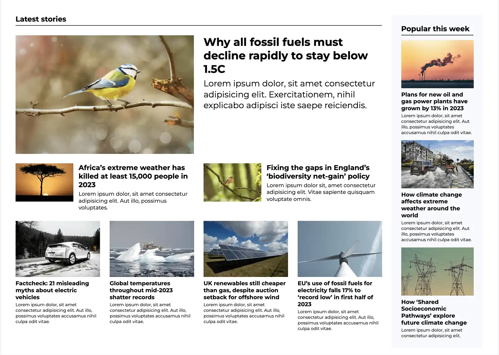
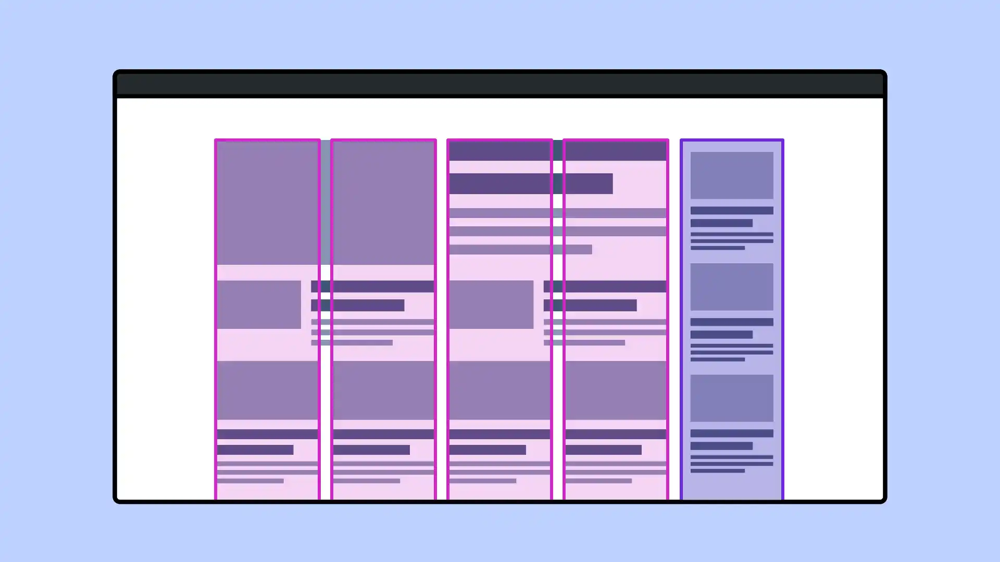
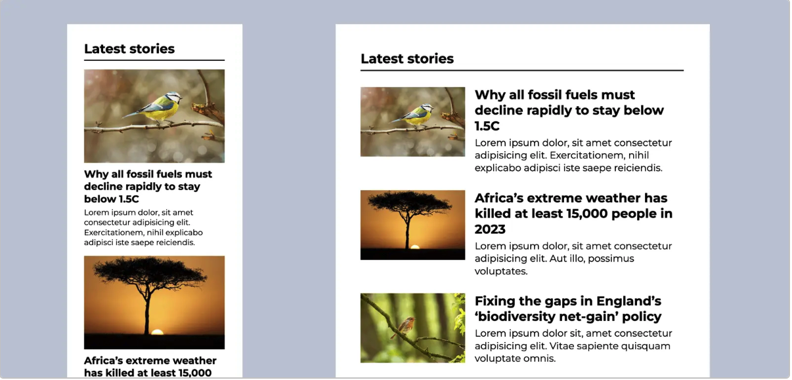
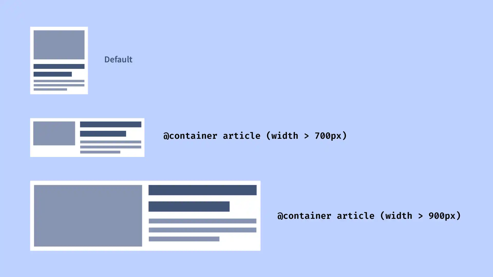
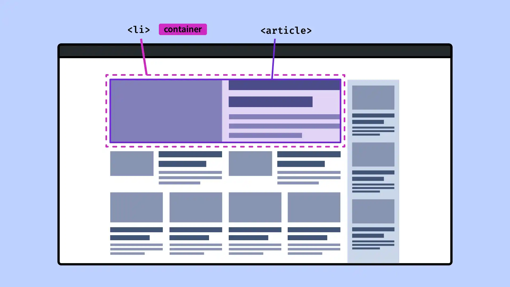

- BFC
- IFC
- FFC
- GFC


## BFC

> Block Foramtting Context  
>
> 容器里面的子元素不会在布局上影响到外部元素

### 触发BFC的条件

float 不为none

overflow不为visible

postion不为relative和static

display 为 table-cell, table-caption, inline-block中的任何一个。


## IFC

> 水平方向的(margin, padding,border)会计算，垂直方向不会
>
> 在垂直方向通过`vertical align`统一容器中item对齐方式（baseline,top,middle)
>
> ```css
> .icon {
>   height: 100px;
> }
> i {
>   vertical-algin: center;
>   line-height: 100px
> }
> span {
>   
> }
> 
> 
> ```
>
> 

> `line-box`高度由行高计算


### IFC用处

> 那么IFC一般有什么用呢？
>  水平居中：当一个块要在环境中水平居中时，设置其为inline-block则会在外层产生IFC，通过text-align则可以使其水平居中。
>  垂直居中：创建一个IFC，用其中一个元素撑开父元素的高度，然后设置其vertical-align:middle，其他行内元素则可以在此父元素下垂直居中。


## Container query


### Desktop layout



### Desktop Layout analysis

> We can divide this into two grids: a 4-column grid on the left, and a single column on the right (the sidebar).
>
> On the left, we have a large featured article spanning four columns. Below this, two articles span two columns each. These have a horizontal layout, with the images on the left and text on the right. Below that are four smaller articles, each spanning a single column, they have a vertical layout,  the images are stacked above the tex



### Mobile Layout




## respond to the available space.







```html
<ul class="grid">
  <li class="article-container">
    <article>...</article>
  </li>
  <li class="article-container">
    <article>...</article>
  </li>
  <li class="article-container">
    <article>...</article>
  </li>
  ...
</ul>
```

```css
.article-container {
  container-name: article;
  container-type: inline-size;
}

article {
  display: grid;
  gap: 1rem;
}
/*
	.article-container {
  container: article / inline-size;
}
*/


@container article (inline-size > 500px) {
  /* Styles for horizontal article */
  article {
    grid-template-columns: 1fr 2fr;
  }
}

@container article (inline-size > 800px) {
  article {
    /* Styles for article in a large space (e.g. featured article) */
    grid-template-columns: 1fr 1fr;
    gap: 2rem;
    font-size: 1.2rem;
  }

  h3 {
    font-size: 2rem;
  }
}
```


```css
/* Old syntax for styles between 700px and 900px */
@container (min-width: 700px) and (max-width: 900px) {
}

/* New syntax */
@container (700px <= width <= 900px) {
}
```


```html
<div class="grid-container">
  <ul class="grid">
    <li class="article-container">...</li>
    <li class="article-container">...</li>
    <li class="article-container">...</li>
    ...
  </ul>
</div>
```

```css
.grid-container {
  container: layout / inline-size;
}
.grid {
  display: grid;
  gap: 1rem;
}

/* Initial styles for single column layout */
.grid {
  display: grid;
  gap: 1rem;
}

@container layout (inline-size > 800px) {
  .grid {
    grid-template-columns: repeat(2, 1fr);
  }

  /* The featured article should span two columns */
  .article-container:first-child {
    grid-column: span 2;
  }
}

@container layout (inline-size > 1000px) {
  .grid {
    grid-template-columns: repeat(4, 1fr);
  }

  .article-container:first-child {
    grid-column: span 4;
  }

  .article-container:nth-child(2),
  .article-container:nth-child(3) {
    grid-column: span 2;
  }

```


## Do we still need media queies?

`prefers-reduced-motion`

`prefers-color-scheme`


[^1]: [media queries](https://developer.mozilla.org/en-US/blog/getting-started-with-css-container-queries/)