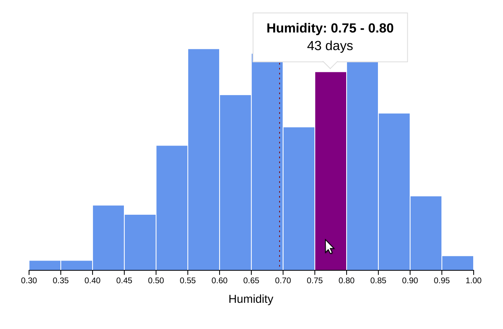
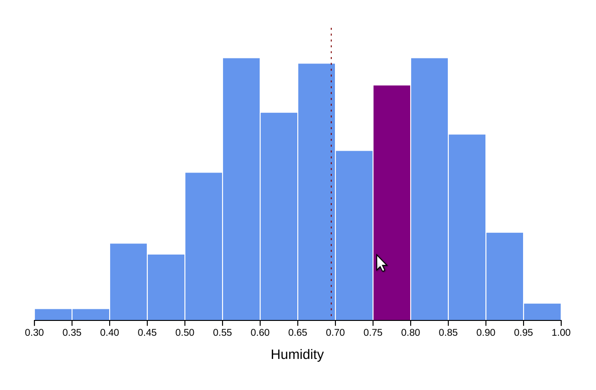
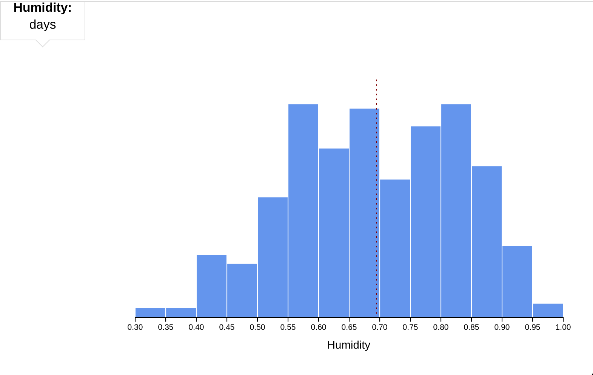
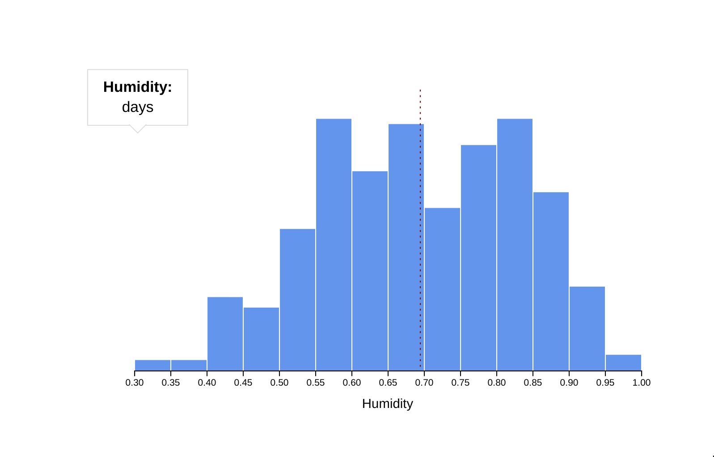
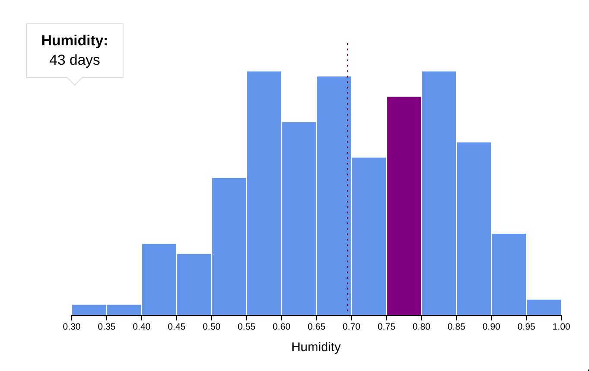
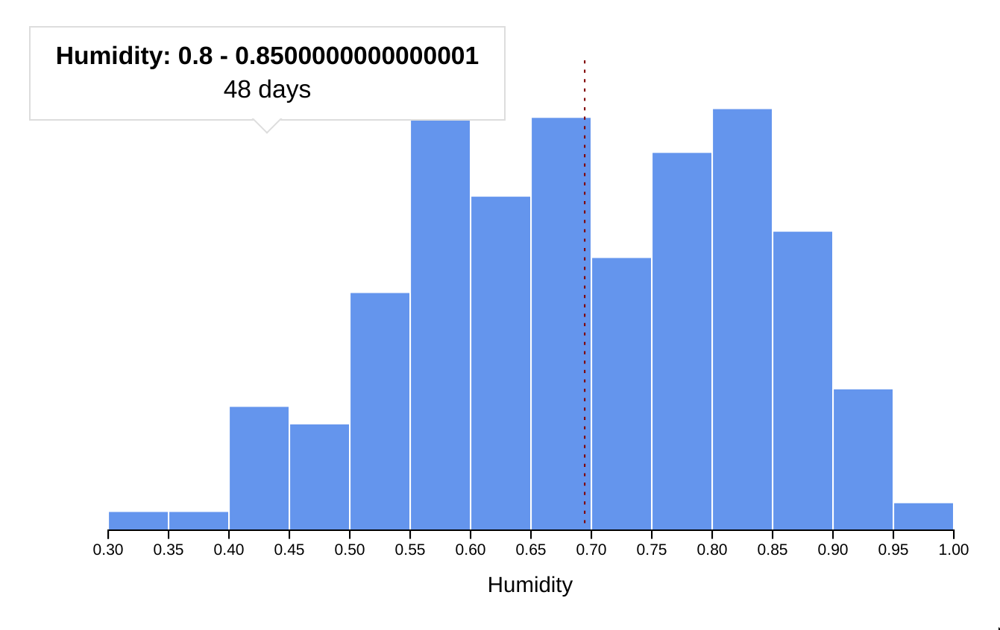

# Bar chart

Let's add interactions to the histogram that we created in **Module 3**.

{width=75%}


Our goal in the section is to add an informative tooltip that shows the humidity range and day count when a user hovers over a bar.

{width=75%}


We could use d3 event listeners to change the bar's color on hover, but there's an alternative: CSS hover states. To add CSS properties that only apply when an element is hovered  over, add `:hover` after the selector name. It's good practice to place this selector immediately after the non-hover styles to keep all bar styles in one place.

<CodeSandboxEmbed
  src="//codesandbox.io/s/3tzqc?fontsize=14&hidenavigation=1&theme=dark&autoresize=1&module=/chart.js"
  style={{width: '100%', height: '35em'}}
/>

Let's add a new selector to the `styles.css` file.

```css
.bin rect:hover {
}
```

Let's have our bars change their fill to purple when we hover over them.

```css
.bin rect:hover {
    fill: purple;
}
```

Great, now our bars should turn purple when we hover over them and back to blue when we move our mouse out.

{width=75%}


Now we know how to implement hover states in two ways: CSS hover states and event listeners. Why would we use one over the other?

**CSS hover states** are good to use for more _stylistic_ updates that don't require DOM changes. For example, changing colors or opacity. If we're using a CSS preprocessor like SASS, we can use any color variables instead of duplicating them in our JavaScript file.

**JavaScript event listeners** are what we need to turn to when we need a more complicated hover state. For example, if we want to update the text of a tooltip or move an element, we'll want to do that in JavaScript.

Since we need to update our tooltip text and position when we hover over a bar, let's add our `mouseenter` and `mouseleave` event listeners at the bottom of our `bars.js` file. We can set ourselves up with named functions to keep our chained code clean and concise.

```javascript
binGroups.select("rect")
    .on("mouseenter", onMouseEnter)
    .on("mouseleave", onMouseLeave)

const onMouseEnter = (event, d) => {
}

const onMouseLeave = (event, d) => {
}
```

Starting with our `onMouseEnter()` function, we'll start by grabbing our tooltip element. If you look in our `index.html` file, you can see that our template starts with a tooltip with two children: a div to display the range and a div to display the value. We'll follow the common convention of using **id**s as hooks for JavaScript and **class**es as hooks for CSS. There are two main reasons for this distinction:

1. We can use classes in multiple places (if we wanted to style multiple elements at once) but we'll only use an id in one place. This ensures that we're selecting the correct element in our chart code

2. We want to separate our chart manipulation code and our styling code — we should be able to move our chart hook without affecting the styles.

A>We could create our tooltip in JavaScript, the same way we have been creating and manipulating SVG elements with d3. We have it defined in our HTML file here, which is generally easier to read and maintain since the tooltip layout is static.

If we open up our **styles.css**, we can see our basic tooltip styles, including using a pseudo-selector `.tooltip:before` to add an arrow pointing down (at the hovered bar). Also note that the tooltip is hidden (`opacity: 0`) and will transition any property changes (`transition: all 0.2s ease-out`). It also will not receive any mouse events (`pointer-events: none`) to prevent from stealing the mouse events we'll be implementing.

Let's comment out the `opacity: 0` property so we can get a look at our tooltip.

```css
.tooltip {
    /* opacity: 0; */
```

We can see that our tooltip is positioned in the top left of our page.

{width=75%}


If we position it instead at the top left of our chart, we'll be able to shift it based on the hovered bar's position in the chart.

We can see that our tooltip is absolutely positioned all the way to the left and 12px above the top (to offset the bottom triangle). So why isn't it positioned at the top left of our chart?

Absolutely positioned elements are placed relative to their **containing block**. The default containing block is the `<html>` element, but will be overridden by certain ancestor elements. The main scenario that will create a new containing block is if the element has a `position` other than the default (`static`). There are other scenarios, but they are much more rare (for example, if a `transform` is specified).

This means that our tooltip will be positioned at the top left of the nearest ancestor element that has a set `position`. Let's give our `.wrapper` element a position of `relative`.

```css
.wrapper {
    position: relative;
}
```

Perfect! Now our tooltip is located at the top left of our chart and ready to be shifted into place when a bar is hovered over.

{width=75%}


Let's start adding our mouse events in `bars.js` by grabbing the existing tooltip using its id (`#tooltip`). Our tooltip won't change once we load the page, so let's define it outside of our `onMouseEnter()` function.

```javascript
const tooltip = d3.select("#tooltip")
function onMouseEnter(event, d) {
}
```

Now let's start fleshing out our `onMouseEnter()` function by updating our tooltip text to tell us about the hovered bar. Let's select the nested `#count` element and update it to display the y value of the bar. Remember, in our histogram the y value is the number of days in our dataset that fall in that humidity level range.

```javascript
const tooltip = d3.select("#tooltip")
function onMouseEnter(event, d) {
    tooltip.select("#count")
        .text(yAccessor(d))
}
```

Looking good! Now our tooltip updates when we hover over a bar to show that bar's count.

{width=75%}


Next, we can update our range value to match the hovered bar. The bar is covering a range of humidity values, so let's make an array of the values and join them with a `-` (which can be easier to read than a template literal).

```javascript
tooltip.select("#range")
    .text([
        d.x0,
        d.x1
    ].join(" - "))
```

Our tooltip now updates to display both the count _and_ the range, but it might be a bit _too_ precise.

{width=75%}


We could convert our range values to strings and slice them to a certain precision, but there's a better way. It's time to meet `d3.format()`.

The [**d3-format**](https://github.com/d3/d3-format) module helps turn numbers into nicely formatted strings. Usually when we display a number, we'll want to parse it from its raw format. For example, we'd rather display `32,000` than `32000` — the former is easier to read and will help with scanning a list of numbers.

If we pass `d3.format()` a **format specifier string**, it will create a formatter function. That formatter function will take one parameter (a number) and return a formatted string. There are many possible format specifier strings — let's go over the format for the options we'll use the most often.

`[,][.precision][type]`

Each of these specifiers is optional — if we use an empty string, our formatter will just return our number as a string. Let's talk about what each specifier tells our formatter.

`,`: add commas every 3 digits to the left of the decimal place

`.precision`: give me this many numbers after the decimal place.

`type`: each specific type is declared by using a single letter or symbol. The most handy types are:

- **f**: fixed point notation — give me `precision` many decimal points
- **r**: decimal notation — give me `precision` many significant digits and pad the rest until the decimal point
- **%**: percentage — multiply my number by 100 and return `precision` many decimal points

Run through a few examples in your terminal to get the hang of it.

```javascript
d3.format( ".2f")(11111.111) // "11111.11"
d3.format(",.2f")(11111.111) // "11,111.11"
d3.format(",.0f")(11111.111) // "11,111"
d3.format(",.4r")(11111.111) // "11,110"
d3.format( ".2%")(0.111)     // "11.10%"
```

Let's create a formatter for our humidity levels. Two decimal points should be enough to differentiate between ranges without overwhelming our user with too many `0`s.

```javascript
const formatHumidity = d3.format(".2f")
```

Now we can use our formatter to clean up our humidity level numbers.

```javascript
const formatHumidity = d3.format(".2f")
tooltip.select("#range")
    .text([
        formatHumidity(d.x0),
        formatHumidity(d.x1)
    ].join(" - "))
```

Nice! An added benefit to our number formatting is that our range numbers are the same width for every value, preventing our tooltip from jumping around.

{width=75%}


Next, we want to position our tooltip _horizontally centered_ above a bar when we hover over it. To calculate our tooltip's `x` position, we'll need to take three things into account:

- the bar's `x` position in the chart (`xScale(d.x0)`),
- half of the bar's **width** ((xScale(d.x1) - xScale(d.x0)) / 2`), and
- the **margin** by which our **bounds** are shifted **right** (`dimensions.margin.left`).

Remember that our tooltip is located at the top left of our **wrapper** - the outer container of our chart. But since our bars are within our **bounds**, they are shifted by the margins we specified.

{width=75%}


Let's add these numbers together to get the `x` position of our tooltip.

```javascript
const x = xScale(d.x0)
  + (xScale(d.x1) - xScale(d.x0)) / 2
  + dimensions.margin.left
```

When we calculate our tooltip's y position, we don't need to take into account the bar's dimensions because we want it placed above the bar. That means we'll only need to add two numbers:

1. the bar's `y` position (`yScale(yAccessor(d))`), and
2. the **margin** by which our **bounds** are shifted **down** (`dimensions.margin.top`)

```javascript
const y = yScale(yAccessor(d))
  + dimensions.margin.top
```

Let's use our `x` and `y` positions to shift our tooltip. Because we're working with a normal xHTML **div**, we'll use the CSS **translate** property.

```javascript
tooltip.style("transform", `translate(`
  + `${x}px,`
  + `${y}px`
  + `)`)
```

A>Why are we setting the **transform** CSS property and not **left** and **top**? A good rule of thumb is to avoid changing (and especially animating) CSS values other than **transform** and **opacity**. When the browser styles elements on the page, it runs through several steps:
A>
A>1. calculate style
A>2. layout
A>3. paint, and
A>4. layers
A>
A>Most CSS properties affect steps 2 or 3, which means that the browser has to perform that step and the subsequent steps every time that property is changed. **Transform** and **opacity** only affect step 4, which cuts down on the amount of work the browser has to do. Read more about each step and this distinction at [https://www.html5rocks.com/en/tutorials/speed/high-performance-animations/](https://www.html5rocks.com/en/tutorials/speed/high-performance-animations/).

Hmm, why is our tooltip in the wrong position? It looks like we're positioning the top left of the tooltip in the right location (above the hovered bar).

{width=75%}


We want to position the **bottom, center** of our tooltip (the tip of the arrow) above the bar, instead. We _could_ find the tooltip size by calling the `.getBoundingClientRect()` method, but there's a computationally cheaper way.

There are a few ways to shift absolutely positioned elements using CSS properties:

- `top`, `left`, `right`, and `bottom`
- `margin`s
- `transform: translate()`

All of these properties can receive percentage values, but some of them are based on different dimensions.

- `top` and `bottom`: **percentage of the parent's height**
- `left` and `right`: **percentage of the parent's width**
- `margin`s:  **percentage of the parent's width**
- `transform: translate()`: **percentage of the specified element**

We're interested in shifting the tooltip based on its own height and width, so we'll need to use `transform: translate()`. But we're _already_ applying a `translate` value — **how can we set the `translate` value using a pixel amount and a width**?

CSS `calc()` comes to the rescue here! We can tell CSS to calculate an offset based on values with different units. For example, the following CSS rule would cause an element to be 20 pixels wider than its container.

```css
width: calc(100% + 20px);
```

Let's use `calc()` to offset our tooltip **up** half of its own width (`-50%`) and **left** `-100%` of its own height. This is in addition to our calculated `x` and `y` values.

```javascript
tooltip.style("transform", `translate(`
  + `calc( -50% + ${x}px),`
  + `calc(-100% + ${y}px)`
  + `)`)
```

Perfect! Now our tooltip moves to the exact location we want.

{width=75%}


We have one last task to do — hide the tooltip when we're not hovering over a bar. Let's un-comment the `opacity: 0` rule in `styles.css` so its hidden to start.

```css
.tooltip {
    opacity: 0;
```

Jumping back to our bars.js file, we need to make our tooltip visible at the end of our `onMouseEnter()` function.

```javascript
tooltip.style("opacity", 1)
```

Lastly, we want to make our tooltip invisible again whenever our mouse leaves a bar. Let's add that to our `onMouseLeave()` function.

```javascript
function onMouseLeave() {
  tooltip.style("opacity", 0)
}
```

Look at that! You just made an interactive chart that gives users more information when they need it. Positioning tooltips is not a simple feat, so give yourself a pat on the back! Next up, we'll learn an even fancier method for making it easy for users to get tooltips even for small, close-together elements.

### Final code for this lesson

<CodeSandboxEmbed
  src="//codesandbox.io/s/rb99u?fontsize=14&hidenavigation=1&theme=dark&autoresize=1&module=/chart.js"
  style={{width: '100%', height: '35em'}}
/>