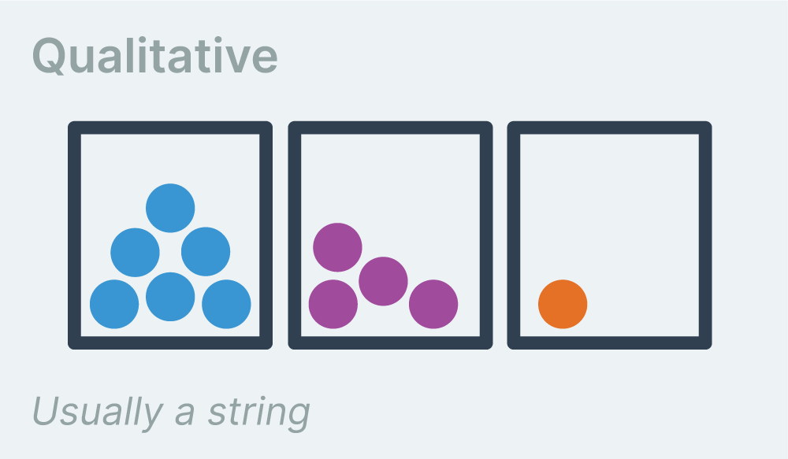
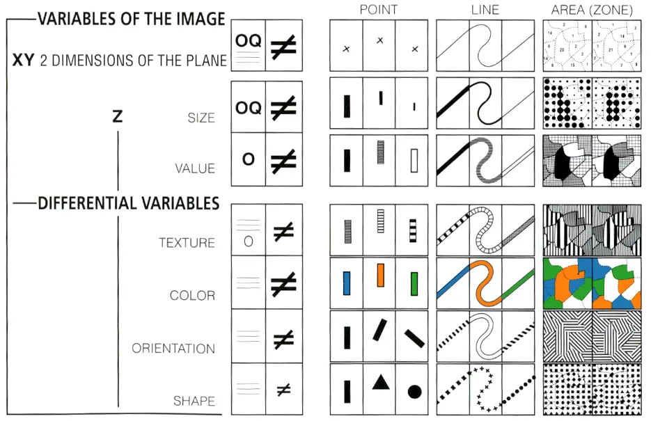

<embed src="../assets/chart-checklist.pdf#zoom=0&amp;scrollbar=1&amp;toolbar=0&amp;navpanes=0" type="application/pdf" width="100%" height="500px">


## Know your data set

### Types of data（quantitative vs  qualitative）

`qualitative data`:  can be put into categories



```ts
type PrecipType/*降雨类型*/ = 'rain' | 'snow' | 'hail' | 'sleet' | 'freezing rain'
}
```

**Binary** data can be placed into only two categories.

```ts
type IsRaining = false | true
```


### categorical vs ordinal

diamond cut quality (fair, good, very good, ideal) is ordinal, 

while diamond cut shape (princess, round, marquise, *etc.*) is categorical.


<embed src="../assets/diamond-shape.pdf#zoom=0&amp;scrollbar=1&amp;toobar=0&amp;navpanes=0#page=2" type="application/pdf" width="100%">


```ts
type DiamondCutShape = 'Round' | 'Princess' | 
'Cushion' | 'Emerald' | 'Oval' | 'Peal'
```


```ts
type WeatherIcon = 'rainy-day' | 'windy-day' | 'sunny-day'
```


```ts
enum WindForce {
  Calm = 0,         // 无风
  LightAir = 1,     // 轻微
  LightBreeze = 2,  // 微风
  GentleBreeze = 3, // 和风
  ModerateBreeze = 4, // 清风
  FreshBreeze = 5,  // 强风
  StrongBreeze = 6, // 劲风
  NearGale = 7,     // 疾风
  Gale = 8,         // 大风
  StrongGale = 9,   // 烈风
  Storm = 10,       // 狂风
  ViolentStorm = 11, // 暴风
  Hurricane = 12    // 飓风
}
```


Quantitative Data

**Discrete** data has numerical values that can't be interpolated between

```ts
enum TyphoonLevel {
  TropicalDepression = 1,  // 热带低压
  TropicalStorm = 2,       // 热带风暴
  SevereTropicalStorm = 3, // 强热带风暴
  Typhoon = 4,             // 台风
  SevereTyphoon = 5,       // 强台风
  SuperTyphoon = 6         // 超强台风
}
```

**Continuous** data

```ts
interface WeatherStation {
  id: string,
  name: string,
  latitude: number,
  longtitude: number,
  temperature: number,
  humidity:number,
  dewPoint: number
}
```


### Ways to visualize a metric


> *The eye is sensitive, to six visual variable. which can be superimposed(叠加) on the planar figures(平面图形): the size of the marks, their position, texture, color, orientation, and shape*




>  a scale is a function that takes an *abstract value* of data, such as the mass of a diamond in carats(以克拉为单位的钻石质量), and returns a *visual value* such as the horizontal position of a dot in pixels(以像素为单位的点的水平位置). 
>
> how you might compute *x* and *y* for each dot above. Given some values derived from data (minCarat, maxCarat, minPrice, maxPrice) and some from the chart size (width, height), you might do something like this

```js
function extend<T>(arr<T>:, accessor?: (d:T)=>:[number,number]) {
  let mix = Infinity;
  let max = -Infinity;
	for (let item of arr) {
		value = accessor ? accessor(item) : item
    if ( value < min) min = value
    if （ value > max) max = value
  }
  return [min, max]
}

function xLinearScale(carvet) {
  return (carat - minCarat) / (maxCarat - minCarat) * width
}

/*
	graphics systems put the origin in the top-left corner whereas scatterplots put it in the bottom-left.
*/ 
function yLinearScale(price) {
  return height - (price - minPrice) / (maxPrice - minPrice) * height
}

```


query element

```js
function parseSelector(selector){
const bracketIndex = selector.indexOf('[');
if (bracketIndex > 0) {
  elemType = selector.slice(0, bracketIndex)
  attrPart = selector.slice(bracketIndex)
} else if (bracketIndex === -1) {
  elemType = selector
} else {
  attrPart = selector
}
	return { elemType, attrPart }
}

function attrSelector(selector){
  const {elemType, attrPart} = parseSelector(selector)
  const attrSelector = attrPart.slice(1,-1)
  
  if (attrSelector.includes('=')){
    [attr, value] = attrSelector.split('=')
  }
}

```


```js
function selectElements(query, Els, findAll = false){
	let result;  

switch(query){
    
    switch(true){
  case query.startWith('#'): // query string prefix/start with a #
    result = Els.find(el => el.getAttribute('id') === query.slice(1)) 
       return result ?  [result] : []
  case query.startWith('.'): 
     Els.filter(el => el.classList.contains(query.slice(1))
		return findAll ? result : result[0]
  default: 
    result = Els.filter(el => el.tagName.toLowercase() === query.toLowerCase())
        return findAll ? result : result[0]
    }
	}
}
```


```js
function drawLineChart(){
  
}
```

### scatterplot（散点图）


```js
function drawScatter() {
  // data Set for API end point
  
  
  // for data Point
  const xAccessor = d => d.dewPoint
  const yAccessor = d => d.humidity
  
  
  // wrapper around native api
  console.log({
    d3: d3.min([1,2,null])
    min: Math.min(...[1.2,null])
  })
  
  const width =  d3.min([
    window.innerWidth * 0.9,
    windw.innerHeight * 0.9
  ])
  
  const DMs = {
    width,
    height: width,
    margin: { // for not touch the edge
      top: 10,
      right: 10,
      bottom: 50,
      left: 50
    }
  }
  
  
  const bounds = wrapper.append('g')
  	.style('transform', `translate(${dimensions.margin.left}px, ${dimensions.margin.top}px`)
  	
  
  // Draw dots
  
  const drawDots = (data, color) => {
    const dots = bounds.selectAll('circle')
    .data(data)
    .enter().append('circle')
    .attr("cx", d => scaleX(xAccessor(d)))
    .attr("cy", d => scaleY(yAccessor(d)))
    .attr("r", 5)
    .attr("fill", color)
  }
  
  // Axis 
  const xAxisGenerator = d3.axisBottom()
  	.scale(xScale)
	
  const xAxis = bound.append('g')
  	.call(xAxisGenerator)
  	.style('transform', `translateY(${dimensions.boundHeight}px)`)
  
 
  
  // Label
  const xLabel = xAxis.append('text')
  	.attr('x', dimensions.boundWidth / 2)
  	.attr('y', dimensions.margin.bottom / 2)
  	.text('Dew point (&deg;F)')
 		.attr('fill', 'black')
  	.style('font-size', '1.4em')
  
  const yLabel = yAxis.append('text')
  	.style('transform', 'rotate(-90deg)')
  	.attr('x', -dimensions.boundHeight / 2)
  	.attr('y', - dimensions.margin.left / 2)
  	.text('Relative Humidity')
  	.style('text-anchor', 'middle')
}
```

## data accessor

| Property  | Type   | Description                                                  |
| :-------- | :----- | :----------------------------------------------------------- |
| dateTime  | String | A single point of time in a combined date and time representation (`{date}T{time}`; for example, `2017-08-29T04:00:00.0000000`). |
| timeZone  | String | Represents a time zone, for example, "Pacific Standard Time". See below for more possible values. |
| timeStamp | String |                                                              |

```json
{
  dewPoint: -1.67, // 露点
  humidity: 0.54
}
```


## reference

### Resource events

| Event Name     | Fired When                                                   |
| :------------- | :----------------------------------------------------------- |
| `error`        | A resource failed to load.                                   |
| `abort`        | The loading of a resource has been aborted.                  |
| `load`         | A resource and its dependent resources have finished loading. |
| `beforeunload` | The window, the document and its resources are about to be unloaded. |
| `unload`       | The document or a dependent resource is being unloaded.      |

### Network events

| Event Name | Fired When                                    |
| :--------- | :-------------------------------------------- |
| `online`   | The browser has gained access to the network. |
| `offline`  |                                               |


resuable chart

>  implement charts as **closures with getter-setter methods**

```js
function chart() {
  var width = 720, // default width
      height = 80; // default height
  function my() {
    // generate chart here, using `width` and `height`
  }
  my.width = function(value) {
    if (!arguments.length) return width;
    width = value;
    return my;
  };
  my.height = function(value) {
    if (!arguments.length) return height;
    height = value;
    return my;
  };
  return my;
}
```


## [Substring matching selectors](https://developer.mozilla.org/en-US/docs/Learn/CSS/Building_blocks/Selectors/Attribute_selectors#substring_matching_selectors)

These selectors allow for more advanced matching of substrings inside the value of your attribute. For example, if you had classes of `box-warning` and `box-error` and wanted to match everything that started with the string "box-", you could use `[class^="box-"]` to select them both (or `[class|="box"]` as described in section above).

| Selector        | Example             | Description                                                  |
| :-------------- | :------------------ | :----------------------------------------------------------- |
| `[attr^=value]` | `li[class^="box-"]` | Matches elements with an *attr* attribute, whose value begins with *value*. |
| `[attr$=value]` | `li[class$="-box"]` | Matches elements with an *attr* attribute whose value ends with *value*. |
| `[attr*=value]` | `li[class*="box"]`  | Matches elements with an *attr* attribute whose value contains *value* anywhere within the string. |


[^udn]: [event reference](https://udn.realityripple.com/docs/Web/Events)

[^d3 gallery][show what d3 is capable of](https://github.com/d3/d3/wiki/Gallery)
