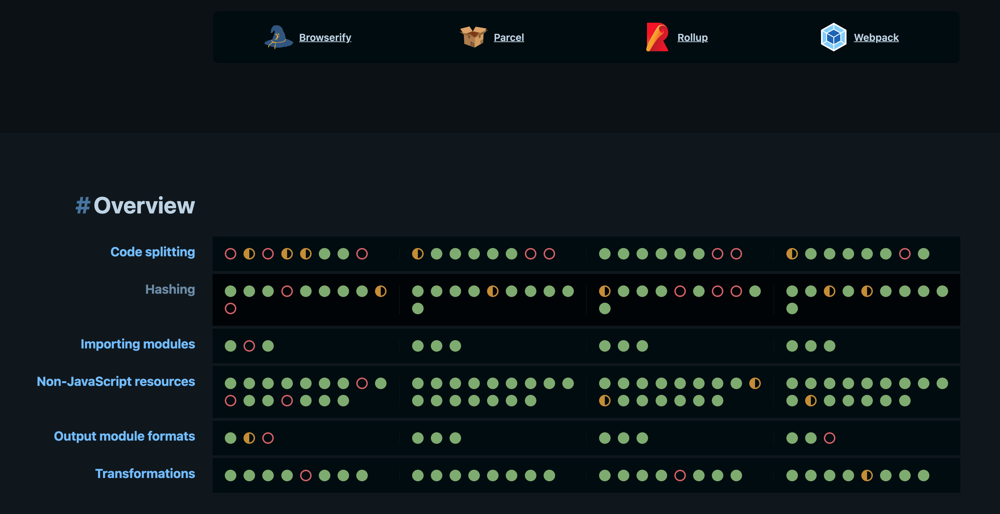

# 搭建开发和调试环境

> dev env & debug env set up

- 项目架构(monorepo)
- 开发规范(lint、commit、style、pretty)
- 编译工具(tsc)
- 选择打包工具

MonoRepo vs MultiRepo 该如何选择


<ul style="list-style-type:circle; padding-left: 30px;">
  <li>`Mono-repo`多个项目放在同一个仓库</li>
 <li>`Multi-repo`每个项目对应单独的一个仓库来管理</li>
</ul>

<span  style="font-size: 18px; display: inline-block; padding-left: 10px; border-left: 5px solid rgb(145, 109, 213);">Mono-repo 技术选型</span>

包管理工具pnpm feature`workspace`:

- [pnpm workspace](https://pnpm.io/installation)

First, let's install command line tool `pnpm` to wrok with `monoRepo` project

```bash
npm i -g pnpm
```

Now use pnpm to init a new `monoRepo` project in current folder

```bash
pnpm init . 
```

在初始化后的`package.json`中,修改配置如下:

```json
{
  "private": true, // not publish to npm registery
  "module": "index.ts", // ESmodule module loading entry 
  "type": "module", // Files ending with .js are loaded as ES modules when the nearest parent package.json file contains a top-level field "type" with a value of "module".
  "packageManager": "pnpm",
  "desc": "react公用方法"
}
```

新建配置文件`pnpm-workspace.yaml`,添加如下配置

```yaml
packages: 
	- "pakcages/*"
```


<span  style="font-size: 18px; display: inline-block; padding-left: 10px; border-left: 5px solid rgb(145, 109, 213);">开发规范</span>

<h3 style="text-align:center;  font-size: 20px;font-weight: bold;"><span style="border-bottom: 2px solid rgb(145, 109,213);">代码规范</span></h3>

安装:

```bash
pnpm i eslint -D -w
```

初始化:

```bash
npx eslint --lint
```

安装 ts 的规范规则集:

> [stylistic rules](https://eslint.style/rules/js/one-var-declaration-per-line)
>
> - require one space before and after an arrow function's arrow(=>).
>
> - disallow spaces between array brackets and other tokens
> - object-curly-spacing
> - one-var-declaration-per-line

```bash
pnpm i -D -w @typescript-eslint/eslint-plugin
```

`.eslintrc.json`配置:

```json
{
  "env": {
    "browser": true,
    "es2021": true,
    "node": true
  },
  // 打开或关闭哪条规则convention
  "extends": [
    "eslint:recommended",
    "plugin:@typescript-eslint/recommended",
    "prettier",
    "plugin:prettier/recommended"
  ],
  // 解析成AST配置
  "parser": "@typescript-eslint/parser",
  "parserOptions": {
    "ecmaVersion": "latest",
    "sourceType": "module"
  },
  // 规则集
  "plugins": ["@typescript-eslint", "prettier"],
  // 自定义打开或关闭某条规则
  "rules": {
    "prettier/prettier": "error",
    "no-case-declarations": "off",
    "no-constant-condition": "off",
    "@typescript-eslint/ban-ts-comment": "off"
  }
}
```

<h3 style="text-align:center;  font-size: 20px;font-weight: bold;"><span style="border-bottom: 2px solid rgb(145, 109,213);">代码风格</span></h3>

安装:

```bash
pnpm i prettier -D -w
```

新建`.prettierrc.json`配置文件, 添加如下配置:

```json
 {
  "printWidth": 80,
  "tabWidth": 2,
  "useTabs": true,
  "singleQuote": true,
  "semi": true,
  "trailingComma": none,
  "bracketSpacing": true
 }
```

将`prettier`集成到`eslint`中, 其中:

<ul style="list-style-type:circle; padding-left: 30px;">
<li>`eslint-config-prettier`: 覆盖`eslint`中与`prettier`冲突的规则配置</li>
<li>`eslint-plugin-prettier`: 用prettier来接管修复代码`eslint --fix`</li>
</ul>
```bash
pnpm i eslint-config-prettier eslint-plugin-prettier -D -w
```


在根项目的`package.json`中,为`lint`增加对应的执行脚本, 并验证效果:

```bash
"lint": "eslint --ext .js,.ts,.jsx,.tsx --fix --quiet ./packages"
```

<h3 style="text-align:center;  font-size: 20px;font-weight: bold;"><span style="border-bottom: 2px solid rgb(145, 109,213);">代码提交</span></h3>

安装`husky`，用于拦截commit命令：
```bash
pnpm i husky -D -w
```
初始化husky

```bash
npx husky init
```

将 `pnpm lint`命令纳入`commit`前`husky`将执行的脚本

```bash
- npx husky add ./husky/pre-commit "pnpm init"
+ echo "pnpm lint" > .husky/pre-commit 
```

通过`commitlint`对 git 提交信息进行检查

```bash
pnpm i -D -w @commitlint/cli @commitlint/config-conventional
```

新建配置文件`.commitlintrc.js`, 添加如下配置：

```js
module.exports = {
  extends: ['@commitlint/config-conventional'],
}
```

集成到`husky`中：

```bash
- npx husky add .husky/commit-msg "npx --no-install commitlint -e $HUSKY_GIT_PARAMS"
// decreparted see [migration guide](https://typicode.github.io/husky/migrate-from-v4.html)
+ 	echo "npx --no-install commitlint -e $HUSKY_GIT_PARAMS" > .husky/commit-msg
```

git 提交格式：

```bash
// 提交的类型： 摘要信息
<type>：<subject>
```

常见的`type`值包括如下：

- `feat`: 添加新功能
- `fix`: 修复 Bug
- `chore`: 一些不影响功能的更改
- `docs`: 针对文档的修改
- `perf`: 性能方面的优化
- `refactor`: 代码重构
- `test`: 添加测试代码等

<h3 style="text-align:center;  font-size: 20px;font-weight: bold;"><span style="border-bottom: 2px solid rgb(145, 109,213);">选择转译工具(transpiler tool)</span></h3>


> "w/o" for "without"  "w/" was borrowed from this "w/" for "with"

新建配置文件`tsconfig.json`，添加如下配置：

```json
{
  "compileOnSave": true,
  "compilerOptions": {
    "target": "ESNext",
    "useDefineForClassFields": true,
    "module": "ESNext",
    "lib": ["ESNext", "DOM"],
    "moduleResolution": "Node",
    "strict": true,
    "sourceMap": true,
    "resolveJsonModule": true,
    "isolatedModules": true,
    "esModuleInterop": true,
    "noEmit": true,
    "noUnusedLocals": true,
    "noUnusedParameters": true,
    "noImplicitReturns": false,
    "skipLibCheck": true,
    "baseUrl": "./packages"
  }
}
```

<h3 style="text-align:center;  font-size: 20px;font-weight: bold;"><span style="border-bottom: 2px solid rgb(145, 109,213);">选择打包工具(bundle tool)</span></h3>


[不同打包工具比较](https://bundlers.tooling.report/)
开发项目特点
<ul style="list-style-type:circle; padding-left: 30px;">
  <li>是基建的库，而不是业务吸纳蒙古</li>
 <li>希望工具尽可能简洁、打包产物可读性高</li>
 <li>原生支持ESM</li>
</ul>

所以这里选择`rollup`, 安装：

```bash
pnpm i -D -w rollup
```
