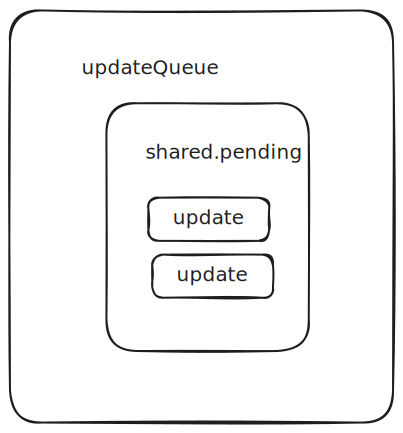
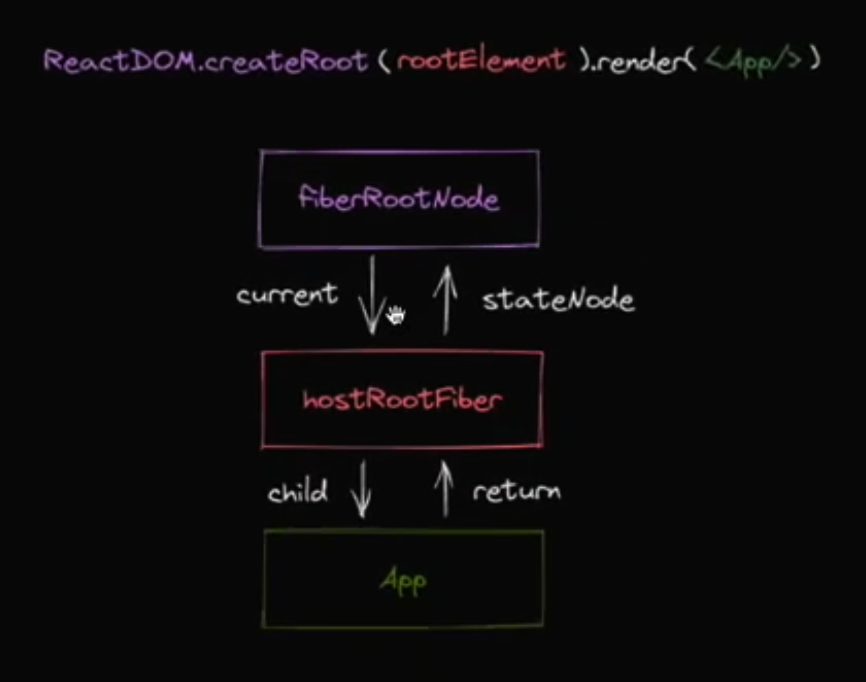

# 如何触发更新

常见的触发更新的方式有：

- ReactDOM.createRoot().render  (首屏渲染，或老版的ReactDOM.render)
- this.setState
- useState的dispatch方法

我们希望实现一套同一的更新机制， 他的特点是：

- 兼容上述触发更新的方式,触发更新的方式是对接到这套更新机制中
- 方便后续扩展（优先级机制..)

 <h3 style="text-align:center;  font-size: 20px;font-weight: bold;"><span style="border-bottom: 2px solid rgb(145, 109,213);">更新机制的组成部分</span></h3>

- 代表更新的数据结构 -- `update`
- 消费`update`的数据结构 -- `UpdateQueue`



接下来的工作包括：

- 实现mount时调用的API
- 将该API接入上述更新机制

需要考虑的是：

- 更新可能发生于任意组件，而更新流程是从根节点递归的
- 需要一个通一的一个根节点保存通用信息

```ts
ReactDOM.createRoot(rootElement).render(<App/>)
```



