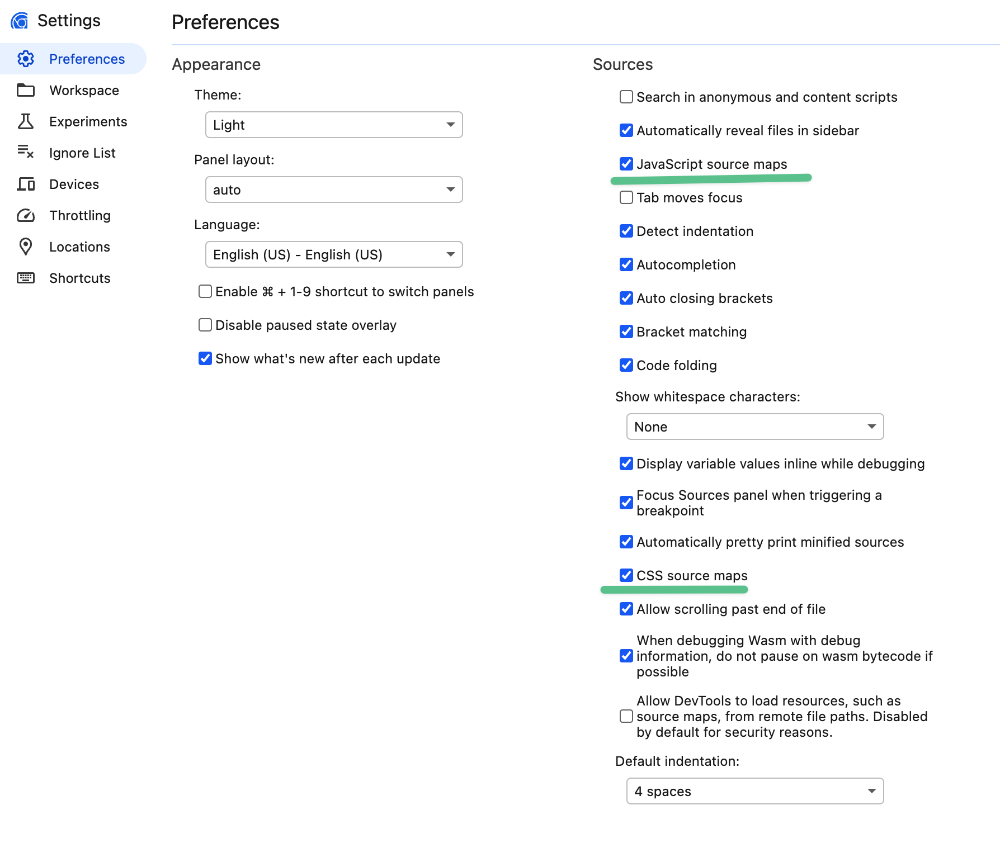

# wepack
transpiled(through loaders),module bundler and more
one reason why we introduce

## specifier resolve
`<script>: type attribute`
- [x] importmap


##  sourcemap

debug your source code instead of deployed code
<file-name>.<line-num>.<col-num>

### 启用sourcemap


```json title="main.js.map"
{
  "sources": [
    "webpack://source_map/.src/utils/parse.js",
    "webpack://source_map/.src/utils/covert.js",
    "webpack://source_map/.src/utils/format.js",
    "webpack://source_map/.src/utils/main.js"
  ]
}
```
enable source map in chrome devtool


### 值的组合

[inline-|eval-|hidden-][nosource-][cheap-[module-]]source-map


### 最佳实践
开发阶段：`source-map`(vue的选择) or `cheap-module-source-map`(react的选择)


`//# sourceURL =` comment tell browser the source file


```js title="webpack.config.js"
{
  "mode": "production",
  "devtool":"source-map"
}
{
  "mode": "development",
  "devtool":"eval"
}

不生成列映射(column mapping)
{
  "mode": "development",
  "devtool":"cheap-source-map"
}


{
  "mode": "production",
  "devtool":"hidden-source-map"
}
`//# sourceMappingURL=bundle.js.map` add manually


{
  "mode": "production",
  "devtool":"nosource-source-map"
}
```
有source code debug info: <filename>.<linenum>.<colnum>
不生成源代码


打包压缩混淆的代码与源代码的映射
第几行第几列报错


## 搭建本地开发服务器
- webpack watch mode
- webpack devServer
- webpkack middleware


- [x] devServer usage via cli

[@webpack > API > COMMAND LINE Interface > Commands > Serve](https://webpack.js.org/api/cli/#serve)

```json
{
  "scripts":{
    "serve": "webpack serve --config webpack.config.js --stats verbose"
    h
  }
}
```

- [x] host配置

获取内网ip
```sh
ifconfig en0 | grep inet
```

`localhost`: `/etc/hosts`配置文件dnslookup为127.0.0.1(回环地址,主机发出的包，被自己接收)

`0.0.0.0`:  listen for requests from the network, not just localhost
内网协作，从手机访问

- [x] 代理和跨域

A request to `http://localhost:8000/api/music/search/artists`

will now proxy the request to ->

`http://localhost:3000/music/search/artists`


`changeOrigin`: true
修改请求头的host字段为`target|forward`，虚拟主机和反爬
```http
host: <backend API host>
```
源码实现
`@npm > http-proxy > lib >http-proxy > common.js`
```js
if(options.changeOrigin){
  outgoing.headers.host =
    required(outgoing.port, options[forward || 'target'].protocol)
    && !hasPort(outgoing.port)
    ? outgoing.host + ":" + outgoing.port
    : outgoing.host
}
```

- [x] 静态资源配置

serve a file in `assets/manifest.json` at `/serve-public-path-url/manifest.json`,

- [x] 完整配置

```js title="webpack.config.js"
module.exports = {
  devServer: {
    hot:true,// 编译错误修复后重新加载页面
    host: 0.0.0.0,
    port: 8000,
    compress: true,
    open:{
      app: {
        name:"Firefox Developer Edition",
        arguments:["--new-window"],
        compress:true
      }
    },
    proxy:[
      {
        context:['/api'],
        target:'http://localhost:3000',
        pathRewrite:{'^/api':''},
        changeOrigin: true
      }
    ],
    // 静态资源
    static: {
      directory: path.join(__dirname, 'assets'),
      publicPath: 'public'，
    },
    historyApiFallback:true
  }
}
```


## 性能优化


- [x] 代码分割code spliting
代码分包的必要性
- prevent duplication


### Resource Hint

> Using these inline directives while declaring your imports allows webpack to output “Resource Hint”

`/* webpackPrefetch: true */` -> `<link rel="prefetch"/>`

`prefetch`: resource is probably needed for next navigation
`preload`: resource will also be needed during the current navigation
pref

### CDN加速

CDN服务器：unpkg、JSDeliver、cdnjs、bootcdn

 import.meta.url,
 document.currentScript,
 script.src
 self.location

```js
const CDN_PATH = process.env.CDN_PATH || /

module.exports = {
  output: {
    publicPath: CDN_PATH
  },
  externals:{
    axios: "axios"
  }
}
```

## Caching

> clients (typically browsers) will hit that server to grab the site and its assets. The last step can be time consuming, which is why browsers use a technique called caching.


the configuration needed to ensure files produced by webpack compilation can remain cached unless their content has changed.


- outputFilename
- Extracting Boilerplate
- Module Identifiers
- Conclusion


```js
module.exports = {
  output: {
    filename:'[name].[contenthash].js',
    clean:true
  }
}
```

- [x] `optimization.splitChunks.cacheGroups`

>extract 3-party libraries(less likely to change), such as `lodash` or `react`, to a separate vendor chunk(Dll)
>This can be done by using the cacheGroups option of the SplitChunksPlugin

!!! note

    dll option will be removed. Webpack 4 should provide good enough perf and the cost of maintaining DLL mode inside Vue CLI is no longer justified.
    [ RFC: beta.10, Upgrading to webpack 4 + vue-loader 15 #1205 ](https://github.com/vuejs/vue-cli/issues/1205)


```js
module.exports = {
  optimization: {
    splitChunks: {
      cacheGroups: {
        vendor: {
          test:/[\\/]node_modules[\\/]/,
          name: "vendor.js"
        },
      }
    }
  }
}
```

run our build to see new 'vender' bundle


### 环境配置的分离

```json
{
  "scripts": {
    "build": "wepack",
    "serve": "webpack serve --config common.config.js --env development"
  }
}

```

```js title="common.config.js"
const path = require('path')
const merge = require('wepack-merge')
const devConfig = require('./dev.config')
const pordConfig = require('./prod.config')

const commonConfig = {
  resolve: {
    alias: {
      "@": path.resolve(__dirname,'src/')
    },
    extensions:['ts','js','jsx','vue',]
    // fullySpecified: true,
  }
}
module.exports = (env,argv) => {
  return merge(commonConfig, prodConfig)
}
```

```js title="prod.config.js"

```

```js title="dev.config.js"

module.exports = {
  devServer: {
    port: 3000,
    open: {
      app: {
        name: "Firefox Developer Edition"
      }
    },
    compress: true,
    proxy: [
      {
        context:['/api'],
        target: "http://localhost:8000",
        pathRewrite:{"^/api": ""},
        changeOrigin: true
      }
    ],
    static: {
      directory: path.join(__dirname, 'public'),
      publicPath: 'public'
    }
  }
}
```


## Tree-shaking

You can imagine your application as a tree. The source code and libraries you actually use represent the green, living leaves of the tree. Dead code represents the brown, dead leaves of the tree that are consumed by autumn. In order to get rid of the dead leaves, you have to shake the tree, causing them to fall.


dead-code elimination
no sideffect unused module export detection

`sideEffects` flag field in `package.json`
```json
{
  "sideEffects":["**/*.css","**/*.scss"]
}
```
`optimization` flag file in `prod.config.js`
```js
const TerserPlugin = require('terser-webpack-plugin')

modules.exports = {
  optimization: {
    usedExports: true, // unused harmony export <func> comment
    sideEffects: true,
    minimize:true,
    minimizer: [
      new TerserPlugin({

      })
    ]
  }
}

```


## 压缩

- [x] html compress

```js
const HtmlWebpackPlugin = require('html-webpack-plugin');
module.exports = {
  plugins: [
    new HtmlWebpackPlugin({
      template:
    })
  ]
}
```


```http
Accept-Encoding: gzip
```

```http
Content-Encoding: gzip
```

## 自定义插件


- [x] 上传到静态资源服务器
```js
const {NodeSSh} = require("node-ssh")

class AutoUploadWebpackPlugin {

  constructor(options) {
    this.options = options
    this.ssh = new NodeSSH()
  }

  apply(compiler) {
    compiler.hooks.afterEmit.tapAsync("AutoPlugin",async (compilation, cb) => {
      const localPath = compilation.outputOptions.path
    // 建立服务器链接
    this.ssh.connectServer()

    // 清空原有内容

    this.ssh.execCommand("rm -rf " + this.options.remotePath)


    // 上传文件
    await this.uploadFiles(localPath, remotePath)

    // 断开链接
    this.ssh.dispose()
  }

  connectServer() {
    this.ssh.connect({
      host: this.options.host,
      port: this.options.port,
      password: this.options.password
    })
  }
  uploadFiles(localPath, remotePath) {
    this.ssh.putDirectory(localPath,remotePath, {
      recursive: true
    })
  }
}

```
```js
new AutoUploadWebpackPlugin({
  port:,
  password: process.env.,
  host:,
})

```
nginx配置
`/etc/nginx/conf.d/webpack.conf`
```txt
server {
  listen 7878;
  location / {
    root /root/projects/yesplaymusic/build;
    index.html;
  }
}
``


## 制造webpack
