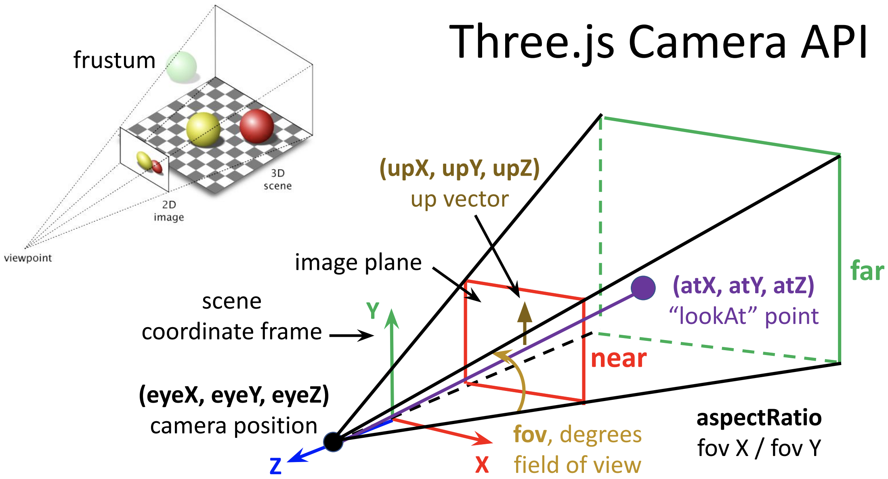

# Synthetic Camera API

There are two aspects to the camera API: the placement of the camera, and the *shape* of the camera. 

```js
const scene = new THREE.Scene()
const renderer = new THREE.WebGLRenderer()
const canvasEl = renderer.domElement
document.body.appendChild(canvasEl)
const size = {
  width: window.innerWidth,
  height: window.innerHeight
}
renderer.setSize(size.width, size.height)
```


Camera Parameters




`frustum`(截断棱锥) :The frustum is also our **view volume**. Anything outside the view volume is "clipped" away and not visible in the rendered image.

 a truncated rectangular pyramid.

- `fov` is the *field of view* that defines the angular extent of the scene that is visible to the camera

- `aspectRatio` controls the ratio of the field of view in the horizontal and vertical directions

- `near` and `far` define the range of distance from the camera over which the scene content is visible
  - red and green lines are drawn around the near and far planes, respectively
  
- `eyeX`, `eyeY`, and `eyeZ` specify the position of the camera (EYE location, shown by the MAGENTA ball)

- `atX`, `atY`, and `atZ` specify the AT point, where the camera is looking (shown by the CYAN ball)

- `upX`, `upY`, and `upZ` specify a vector that indicates the UP direction for the camera (shown in yellow)

```js
var cameraParams = {
    near: 5,
    far: 30,
    fov: 75,                 
    aspectRatio: 400.0/300.0, 
    atX: 0,
    atY: 0,
    atZ: 0,
    eyeX: 0,
    eyeY: 0,
    eyeZ: 25,
    upX: 0,
    upY: 1,
    upZ: 0
};
```


```js
function setupCamera(cameraParams) {
  var cp = cameraParams;
  
  frustumCamera = new THREE.PerspectiveCamera(cp.fov, cp.aspectRatio, cp.near, cp.far)
  // set location
  frustumCamera.position.set(cp.eyeX, cp.eyeY, cp.eyeZ)
  frustCamera.up.set(cp.upX, cp.upY, cp.upZ)
  // camera orientation from its position
  furstCamera.lookAt(cp,atX, cp.atY, cp.atZ)
  return furstCamera
}

const camera = setupCamera(cameraParams)
scene.add(camera)
```

- The "eye" point is the location of the focal point, view reference point.


define a  wrapper function to do the rendering:

```js
function render() {
  renderer.render(scene, camera)
}
render()
```


## terms used for all kins of motions for cameras

- pan: rotating a fixed camera around a vertical axis
  平移：围绕垂直轴旋转固定摄像机
- tilt: rotating a fixed camera around a horizontal axis
  倾斜：围绕水平轴旋转固定相机
- zoom: adjusting the lens to zoom in or out (this adjusts the frustum)
  变焦：调整镜头放大或缩小（这调整视锥体）
- roll: rotating a camera or a ship around a longitudinal axis
  滚动：绕纵轴旋转相机或船
- pitch: same as tilt, but for ships and airplanes
  俯仰：与倾斜相同，但适用于船舶和飞机
- yaw: same as pan, but for ships and airplanes
  偏航：与平移相同，但适用于船舶和飞机
- strafe: moving a camera along a horizontal axis; this terminology is used in video games I believe.
  扫射：沿水平轴移动相机；我相信这个术语被用在视频游戏中。
