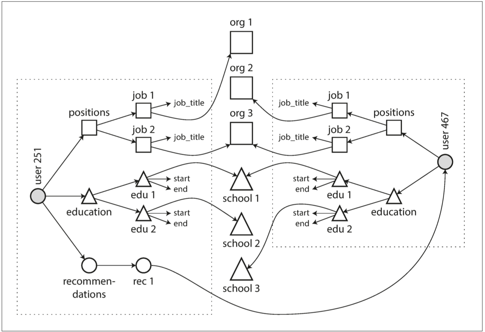

# 2. Data Models and Query Languages

> *The limits of my language mean the limits of my world.*
>
> ​    — Ludwig Wittgenstein, *Tractatus Logico-Philosophicus* (1922)

---

[[toc]]

## data model absraction layer

> each layer hides the implemenation complexity of the layers below it

1. As an application developer，model in terms of objects or data structures, and API that manipulate those data structures
2. store format/ data model: JSON/XML/relational table/ graph
3. db engineer:represent JSON/XML/relational table/ graph data in terms of bytes in-memory, on disk or on network,
4. hardware enginner: represent bytes in electrical, pulses of light, magnetic fields(电流，光脉冲,磁场)

## relational model,document model,graph-based data models

关系数据库起源于商业数据处理

典型的事务处理（银行交易，航空公司预订，库存记录在库）和 批处理（客户发票，工资单，报告）


::: info
在 20 世纪 70 年代和 80 年代初，网状模型（network model）和层次模型（hierarchical model）曾是主要的选择，但关系模型（relational model）随后占据了主导地位
::: 


ActiveRecord & Hibernate ORM(object-realtional mapping) 


**使用关系型模式来表示领英简介**

教育和联系信息放在单独的表中，对 User 表提供外键引用


**用 JSON 文档表示一个 LinkedIn 简介**

```json
{
  "user_id": 251,
  "first_name": "Bill",
  "last_name": "Gates",
  "summary": "Co-chair of the Bill & Melinda Gates... Active blogger.",
  "region_id": "us:91",
  "industry_id": 131,
  "photo_url": "/p/7/000/253/05b/308dd6e.jpg",
  "positions": [
    {
      "job_title": "Co-chair",
      "organization": "Bill & Melinda Gates Foundation"
    },
    {
      "job_title": "Co-founder, Chairman",
      "organization": "Microsoft"
    }
  ],
  "education": [
    {
      "school_name": "Harvard University",
      "start": 1973,
      "end": 1975
    },
    {
      "school_name": "Lakeside School, Seattle",
      "start": null,
      "end": null
    }
  ],
  "contact_info": {
    "blog": "http://thegatesnotes.com",
    "twitter": "http://twitter.com/BillGates"
  }
}
```

从用户简介文件到用户职位，教育历史和联系信息，这种一对多关系隐含了数据中的一个树状结构，而 JSON 表示使得这个树状结构变得明确


region_id 和 industry_id 是以 ID，而不是纯字符串 “Greater Seattle Area” 和 “Philanthropy” 的形式给出的。为什么？


用户界面给出文本段来输入区域和行业，另一方式是给出地理区域和行业的标准化的列表，并让用户从下拉列表中进行选择或自动填充(获取地理位置)

本地化支持 —— 当网站翻译成其他语言时，标准化的列表可以被本地化，使得地区和行业可以使用用户的语言来显示
更好的搜索支持 —— 例如，搜索华盛顿州的慈善家就会匹配这份简介，因为地区列表可以编码记录西雅图在华盛顿这一事实（从 “Greater Seattle Area” 这个字符串中看不出来）


存储 ID 还是文本字符串，这是个 副本（duplication） 问题。当使用 ID 时，对人类有意义的信息（比如单词：Philanthropy）只存储在一处，所有引用它的地方使用 ID（ID 只在数据库中有意义）。当直接存储文本时，对人类有意义的信息会复制在每处使用记录中。

使用 ID 的好处是，ID 对人类没有任何意义，因而永远不需要改变：ID 可以保持不变，即使它标识的信息发生变化。任何对人类有意义的东西都可能需要在将来某个时候改变 —— 如果这些信息被复制，所有的冗余副本都需要更新。这会导致写入开销，也存在不一致的风险（一些副本被更新了，还有些副本没有被更新）。去除此类重复是数据库 规范化（normalization） 的关键思想。[^ii]

::: tip INSIGHT
关于关系模型的文献区分了几种不同的规范形式，但这些区别几乎没有实际意义。一个经验法则是，如果重复存储了可以存储在一个地方的值，则模式就不是 规范化（normalized） 的。
:::


## 多对一和多对多的关系


多对一的关系（许多人生活在一个特定的地区，许多人在一个特定的行业工作）

* 组织和学校作为实体

    在前面的描述中，organization（用户工作的公司）和 school_name（他们学习的地方）只是字符串。也许他们应该是对实体的引用呢？然后，每个组织、学校都可以拥有自己的网页（标识、新闻提要等）。每个简历可以链接到它所提到的组织和学校，并且包括他们的图标和简介

    

*  职位表不再仅存储一个公司名，还是一个指向公司实体的链接
对组织，学校和其他用户的引用也需要表示成引用，并且在查询时需要连接。



* 推荐

  假设你想添加一个新的功能：一个用户可以为另一个用户写一个推荐。在用户的简历上显示推荐，并附上推荐用户的姓名和照片。如果推荐人更新他们的照片，那他们写的任何推荐都需要显示新的照片。因此，推荐应该拥有作者个人简介的引用。

  


### 如何以最佳方式在数据库中表示多对多关系


### 文档模型的模式灵活性

文档数据库有时称为 无模式（schemaless），但这具有误导性，因为读取数据的代码通常假定某种结构
读时模式，即 schema-on-read
写时模式，即 schema-on-write


而现在想分别存储名字和姓氏。在文档数据库中，只需开始写入具有新字段的新文档，并在应用程序中使用代码来处理读取旧文档的情况。例如：

```go
if (user && user.name && !user.first_name) {
  // Documents written before Dec 8, 2013 don't have first_name
  user.first_name = user.name.split(" ")[0];
}
```
另一方面，在 “静态类型” 数据库模式中，通常会执行以下 迁移（migration） 操作：

```sql
ALTER TABLE users ADD COLUMN first_name text;
UPDATE users SET first_name = split_part(name, ' ', 1);      -- PostgreSQL
UPDATE users SET first_name = substring_index(name, ' ', 1);      -- MySQL
```

数据是异构的，模式的坏处远大于它的帮助


## 数据库查询语言


### 声明式查询

选中项在视觉上突出显示

```css
li:hover {
    background-color: var(--color-brand)
}
li.selected {
    background-color: var(--color-brand)
}
```
```js

var liElements = document.getElmentByTagName('li')
for(var i=0; i< liElements.length; i++){
    if(liElements[i].classList.contains('selected')){
        liElements[i].appendAttribute('style', 'background')
    }
}

Element.prototype.appendAttribute(name,value){
   if(this.hasAttribute(name)){
        const existingValue = this.getAttribute(name) 
        this.setAttribute(name, value + existingValue)
    } else {
        this.setAttribute(value)
    }
}
```

如果选定的类被移除（例如，因为用户点击了不同的页面），即使代码重新运行，蓝色背景也不会被移除 - 因此该项目将保持突出显示，直到整个页面被重新加载。使用 CSS，浏览器会自动检测 li.selected > p 规则何时不再适用，并在选定的类被移除后立即移除蓝色背景

### MapReduce查询

在 PostgreSQL 中，你可以像这样表述这个查询：

假设你是一名海洋生物学家，每当你看到海洋中的动物时，你都会在数据库中添加一条观察记录。现在你想生成一个报告，说明你每月看到多少鲨鱼。
```php
SELECT
  date_trunc('month', observation_timestamp) AS observation_month,
  sum(num_animals)                           AS total_animals
FROM observations
WHERE family = 'Sharks'
GROUP BY observation_month;
```
date_trunc('month'，timestamp) 函数用于确定包含 timestamp 的日历月份，并返回代表该月份开始的另一个时间戳。换句话说，它将时间戳舍入成最近的月份。

这个查询首先过滤观察记录，以只显示鲨鱼家族的物种，然后根据它们发生的日历月份对观察记录果进行分组，最后将在该月的所有观察记录中看到的动物数目加起来。

## 图数据模型

以从社交网络数据库中获得：它显示了两个人，来自爱达荷州的 Lucy 和来自法国 Beaune 的 Alain。他们已婚，住在伦敦。


查询图表中的数据
 Neo4j，Titan 和 InfiniteGraph 实现）和三元组存储（triple-store）模型（由 Datomic、AllegroGraph 等实现）。我们将查看图的三种声明式查询语言：Cypher，SPARQL 和 Datalog。除此之外，还有像 Gremlin 【36】这样的图形查询语言和像 Pregel 这样的图形处理框架

 ### 属性图

在属性图模型中，每个顶点（vertex）包括：

    唯一的标识符
    一组出边（outgoing edges）
    一组入边（ingoing edges）
    一组属性（键值对）

每条边（edge）包括：

    唯一标识符
    边的起点（尾部顶点，即 tail vertex）
    边的终点（头部顶点，即 head vertex）
    描述两个顶点之间关系类型的标签
    一组属性（键值对）

```js
CREATE TABLE vertices (
  vertex_id  INTEGER PRIMARY KEY,
  properties JSON
);

CREATE TABLE edges (
  edge_id     INTEGER PRIMARY KEY,
  tail_vertex INTEGER REFERENCES vertices (vertex_id),
  head_vertex INTEGER REFERENCES vertices (vertex_id),
  label       TEXT,
  properties  JSON
);

CREATE INDEX edges_tails ON edges (tail_vertex);
CREATE INDEX edges_heads ON edges (head_vertex);
```


## Summary


数据最开始被表示为一棵大树（层次数据模型），但是这不利于表示多对多的关系，所以发明了关系模型来解决这个问题。最近，开发人员发现一些应用程序也不适合采用关系模型。新的非关系型 “NoSQL” 数据存储分化为两个主要方向：

    1. 文档数据库 主要关注自我包含的数据文档，而且文档之间的关系非常稀少。
    2. 图形数据库 用于相反的场景：任意事物之间都可能存在潜在的关联。


文档数据库和图数据库有一个共同点，那就是它们通常不会将存储的数据强制约束为特定模式，这可以使应用程序更容易适应不断变化的需求。

但是应用程序很可能仍会假定数据具有一定的结构,区别仅在于模式是（写入时强制）还是（读取时处理）。


每个数据模型都具有各自的查询语言或框架
虽然我们已经覆盖了很多层面，但仍然有许多数据模型没有提到。举几个简单的例子：

    使用基因组数据的研究人员通常需要执行 序列相似性搜索，这意味着需要一个很长的字符串（代表一个 DNA 序列），并在一个拥有类似但不完全相同的字符串的大型数据库中寻找匹配。这里所描述的数据库都不能处理这种用法，这就是为什么研究人员编写了像 GenBank 这样的专门的基因组数据库软件的原因【48】。
    粒子物理学家数十年来一直在进行大数据类型的大规模数据分析，像大型强子对撞机（LHC）这样的项目现在会处理数百 PB 的数据！在这样的规模下，需要定制解决方案来阻止硬件成本的失控【